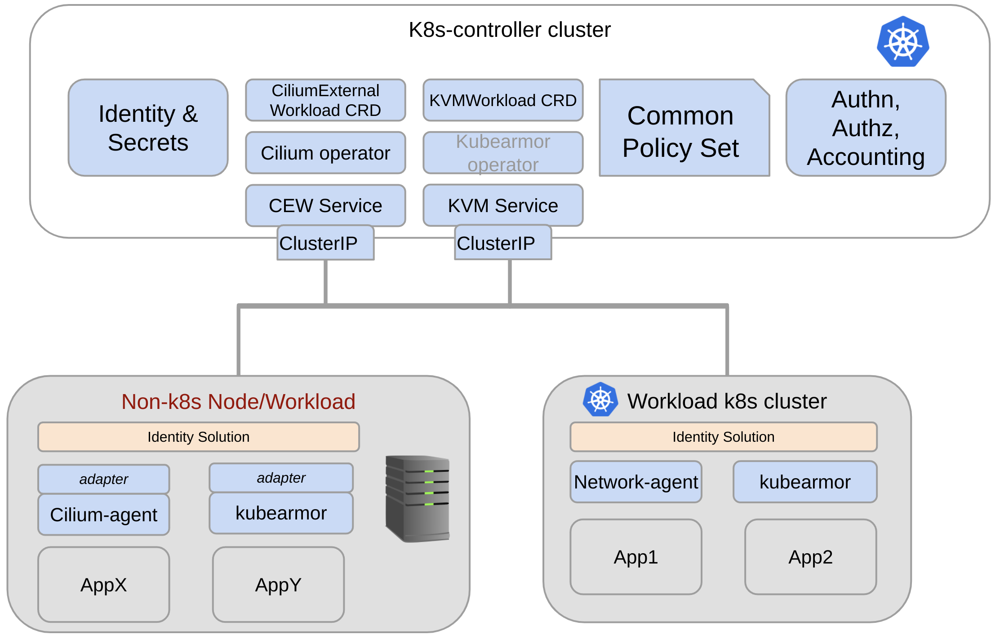
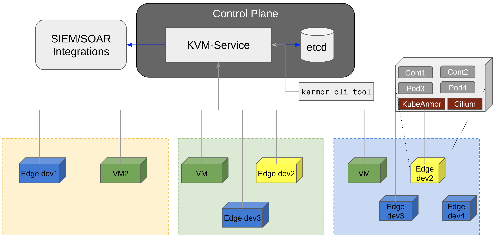

# KubeArmor VM Service (kvmservice)

## Introduction

Kubearmor Virtual Machine Service allows orchestrating policies to VMs and Bare-Metal environments using either k8s or non-k8s control plane.
kvmservice can either run as:
1. k8s service + operator in k8s based control plane
2. directly on VM/Bare-metal as systemd process

### Use-cases/Requirements
- [x] Onboard kubearmor/cilium to virtual machines/bare-metals/edge-devices
- [x] Orchestrate kubearmor and cilium policies to VMs
- [x] Handle observability in a unified manner
- [x] Support hybrid deployments of k8s and Virtual machines based workloads.
- [x] Support automated policy discovery for kubearmor/cilium for VMs

> Note: Virtual Machines, Bare-Metal machines, Edge Devices can be used interchangeably in this document.

## High Level Arch for Hybrid Deployment

A deployment might have workloads distributed across both k8s and non-k8s (VM-based) environments. The primary aim is to support kubearmor/cilium onboarding, policy orchestration, observability across these environments using the same toolsets. This allows simplified management of workloads for organizations who are in the midst of migrating to k8s from VMs or for those who might rely on VMs for a forseable future.

## High Level Arch for VM-only deployments

There are organizations who might not support k8s for forseable future and their workloads will primarily be on cloud VMs or their own data-center VMs or even bare-metal machines. kvmservice allows onboarding, policy orchestration, observability for such environments.

## Additional Documents

* [Deploying KubeArmor at scale on VMs using non-k8s control plane](./getting-started/kvmservice-nonk8s.md)
* [Google Slides for initial design discussions](https://docs.google.com/presentation/d/1aa0fVLWHcVkaGbb70Jy6dek7KOYIAailx3and-mjh8M/edit?usp=sharing)

